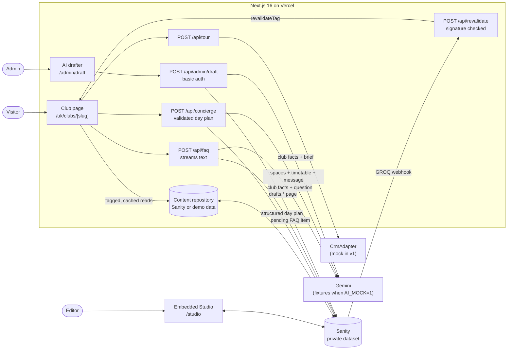

# Club Launch

[](https://github.com/huchu19/club-launch/actions/workflows/ci.yml)

A CMS-driven platform for launching social wellness club pages. Editors build each club's page from
pre-built, tested blocks. Two AI helpers draft pages and answer visitor questions, and an editor
always has the final say.

- **Live app:** https://club-launch-kappa.vercel.app (club page:
  [/uk/clubs/linden-mayfair](https://club-launch-kappa.vercel.app/uk/clubs/linden-mayfair))
- **Storybook:** https://club-launch-storybook.vercel.app
- **Walkthrough video:** _link added after recording_
- **Docs:** [architecture](docs/architecture.md), [roadmap](docs/roadmap.md),
  [product spec](docs/SPEC.md), [design](docs/DESIGN.md)

Designed around a premium operator's rollout of social wellness clubs, where existing gyms are
relaunched one site at a time.

## The problem

Converting a gym into a social wellness club is a launch, not a CMS edit. Every site needs a
marketing page, tour bookings, and answers to the same member questions. When each launch is a
bespoke build, the pages drift apart, launches wait on engineers, and FAQs lag behind what people
actually ask.

## What it does

- **Club pages from blocks.** Hero, facilities, spa and recovery, rates, tour booking and FAQ. Each
  block is one Sanity type and one React component with its own Storybook stories and tests.
  Editors arrange blocks in the embedded Studio at `/studio` and publish; the live page updates
  through a signed webhook, without a redeploy.
- **Plan your first day.** Visitors describe their week (or tap a quick option) and get a
  4–6 stop timeline through a day at the club, built from its real spaces, hours and timetable.
  Every stop is checked against the club's data before it is shown, with one retry if the model
  gets something wrong. Health mentions always carry a caveat to see a professional. "Book a tour
  for this day" attaches the plan to the tour request, so the team can shape the visit; the
  visitor's own words are never stored or shared. "Share my day" gives a read-only link to
  the plan (never indexed) with a generated social card in the site's type and colours.
- **Time-of-day atmosphere.** The hero follows the club's own clock: morning, midday, evening
  and night each get editor-written wording, a subtle tint, and a link to the part of the page
  that suits that time (this morning's classes; spa and recovery in the evening). It is chosen
  on the server, so there's no flash, and the page regenerates every 15 minutes to keep up.
- **How busy is it.** Typical busyness by hour for each space, day by day, with the quietest
  hour picked out, plus "usually quiet at this time" on the map and quieter times suggested by
  the planner when a visitor mentions crowds. The figures are **illustrative**: simulated by a
  seeded generator with realistic peaks for this demo. A real club would feed in its
  gate-entry data instead.
- **Explorable club map.** An illustrated two-floor plan: choose a space (mouse, touch or
  arrow keys) to see what it's for, its hours today, and what's on now and next in the club's
  own time zone, then "Add to my day" to hand it to the planner. A list view has the same
  content. The floor plan is **invented and illustrative**: real floor plans aren't public and
  could be confidential. For a real rollout, the operator's architect drawings would be
  simplified into the same zone format (rectangles and polygons tied to spaces), which editors
  can adjust in the CMS.
- **What it really costs.** A calculator turns the club's real prices into a cost per visit:
  a visits-per-week slider, what you'd use, and which plan. It compares the month with paying
  separately at typical local prices (edited per market in the CMS and labelled as
  illustrative), and always shows the joining fee spread over the first year. The arithmetic is
  a pure, unit-tested module; the chart is plain HTML with a screen-reader table.
- **Tour booking.** An accessible form that is validated on both client and server, with a
  honeypot, per-IP rate limiting, and a `CrmAdapter` interface that retries once. v1 ships a mock
  adapter that logs a redacted line.
- **Infinite FAQ.** Visitors ask "Anything else?". The answer streams in, grounded only on that
  club's facts and approved answers, and is saved as a **pending** item for an editor to approve.
  Repeat questions are answered from the saved item without calling the model.
- **AI page drafter.** At `/admin/draft` (basic auth), a brief becomes an **unpublished draft**
  page. Any price, date or number the model doesn't have becomes a `[[PLACEHOLDER]]`, and Studio
  won't publish the page until every placeholder is replaced.
- **Question insights for club managers.** At `/admin/insights` (basic auth): what visitors
  ask most, with near-duplicates grouped by word overlap (no embeddings), which questions still
  need an approved answer (flagging ones the assistant couldn't answer), what's new this week,
  and what first-day planners care about (options chosen, caveats, spaces). Each question links
  straight to its answer in Studio.
- **Launch readiness check.** Every club page gets a readiness score in Studio: a badge on the
  document, a live checklist on the form, and a "Launch readiness" tool listing all pages. The
  checks: no `[[placeholders]]`, alt text on every image, SEO title and description within
  length, valid opening hours, a joining fee with every price, a tour form, and at least five
  approved FAQs. Publishing is blocked until every check passes.
- **SEO and performance.** Pages are statically rendered and revalidated by tag. Each page has
  `generateMetadata`, a canonical URL and `HealthClub` JSON-LD, and the site serves a sitemap and
  robots file. Images go through Sanity's CDN.

## Architecture

The full design, including request flows and the AI safety model, is in
[docs/architecture.md](docs/architecture.md).



All Sanity reads happen on the server with a token, and the dataset is private. The content
repository has two implementations: Sanity, and an in-memory store built from the same demo data
that `pnpm seed` writes. CI, e2e and local development without credentials use the in-memory store
(`CONTENT_MOCK=1`).

## Key decisions and trade-offs

- **One block, one type, one component, one story.** Editors can't break the layout, and every
  block is tested in isolation, including its accessibility.
- **Static by default, revalidated on demand.** Published reads are cached by document type and
  club slug. The webhook expires tags immediately (`revalidateTag(tag, { expire: 0 })`). Tags are
  coarse, which is correct and cheap at this scale.
- **The drafter returns one strict object per block** rather than a free-form array. Gemini's
  structured output handles fixed shapes more reliably, and every page gets all six blocks.
- **Plain-text streaming for the FAQ, with status in headers.** The client needs to know whether
  an answer came from the cache, the model or the fallback before it reads the body.
- **In-memory rate limiting, per instance.** Free and simple. On serverless each warm instance
  keeps its own window, so the real limit is higher. A shared store is the next step (see below).
- **Free tiers only.** Gemini's free tier, Sanity's free plan, and Vercel Hobby. Images are served
  by Sanity's CDN, so Vercel's image quota is never used.

## How AI is kept safe

- **AI never publishes.** It creates Sanity drafts (`drafts.` ids) and pending FAQ items only.
  Only answers with `status == "approved"` render for visitors.
- **Grounded on one club.** The FAQ model sees only that club's document and its approved answers.
  The drafter sees only the club's facts: no contact details, and nothing about other clubs.
- **Nothing launches half-finished.** Beyond placeholders, the readiness gate blocks publishing
  until images have alt text, SEO is complete, hours are valid, every price shows its joining
  fee, the tour form is present and at least five answers are approved.
- **Placeholders block publishing.** A document-level validation rule fails while any `[[`
  remains, and a Studio banner lists what's left. After the model responds, any number that isn't
  in the club's facts is wrapped as `[[CHECK: n]]`.
- **Visitor text is data, not instructions.** It is fenced in tags, stripped of `<` and `>`, and
  the instructions say to treat it only as a question. Emails and phone numbers are redacted
  before the model or the CMS sees them. Form submissions never go to the model.
- **Everything is validated with zod**: every API input, the drafter's output (retried once, then
  a clear error), and the FAQ answer before it is saved. Day plans are also checked against the
  club's real spaces, opening hours and timetable, and the problems are fed back for one retry.
- **Health mentions get a caveat, never advice.** The concierge may suggest gentle classes or
  recovery, and the server guarantees a caveat pointing to a GP or physiotherapist.
- **Refusals and fallbacks.** Medical, personal-data and unlisted-price questions get a short,
  polite pointer to a tour. Quota and API errors return a friendly fallback, and nothing is
  saved.

## Testing

| Layer | What | Where |
|---|---|---|
| Unit (Vitest) | Schemas, normalisation, grounding context, prompt fencing, redaction, rate limiter, CRM retry, drafter retry, number guard, publish rule, day-plan validator and retry, health caveats, cost calculation edge cases, "what's on now" across time zones and midnight, floor-plan geometry, JSON-LD, webhook signatures, API routes | `**/*.test.ts` |
| Component (Storybook + Vitest browser) | Every component in light, dark and mobile, with edge cases and interaction tests; any axe violation fails the build | `**/*.stories.tsx` |
| End to end (Playwright + axe) | Keyboard-only tour booking; keyboard-only day planning and booking a tour for that day; the cost calculator with real arrow-key presses; the club map by keyboard and touch, with no layout shift and reduced motion; the time-of-day hero with no hydration warnings; the busyness charts by keyboard; the insights page behind admin auth, loading in under a second; shared day pages (plan only, noindex, the social image route) and the copy-link fallback; no sideways scrolling on a phone; health caveats and refusals; FAQ streaming, session-only pending answers, cache hits, refusals and the quota fallback; the drafter; admin auth | `e2e/` |

All AI calls in CI and e2e use `AI_MOCK=1`: deterministic fixtures that still run through the real
AI SDK code (`MockLanguageModelV4`). A question or day-planning message containing "quota"
triggers the quota fixture; a planning message containing "retry" returns an invalid plan first,
to exercise the validator's retry.

## How I built this

I designed the architecture, wrote the product specification and the acceptance criteria for each
milestone, and used [Claude Code](https://claude.com/claude-code) as a pair programmer to implement
them. Every change went through the test suite, accessibility checks and CI before it shipped, and
I reviewed and refactored the output. The engineering standards the code follows are in
[CLAUDE.md](CLAUDE.md).

## Run it locally

Requires Node 24 and pnpm 12.

```bash
pnpm install
cp .env.example .env.local   # works as-is with demo content; add Sanity and Gemini keys to go live
pnpm dev                     # http://localhost:3000
```

Without a Sanity project id, the site serves the bundled demo content, and `/studio` explains
what to configure. With Sanity configured:

```bash
pnpm seed           # market, a fully built Mayfair-style page, a Moorgate-style club with facts only
pnpm seed --reset   # also removes Moorgate drafts and AI FAQ items, to rehearse the demo
pnpm seed --update  # only adds missing documents, fields and blocks; safe on a live dataset
```

| Command | What it does |
|---|---|
| `pnpm lint` / `pnpm typecheck` / `pnpm test` | ESLint, TypeScript, Vitest unit tests |
| `pnpm storybook` / `pnpm test-storybook` / `pnpm build-storybook` | Storybook, its component and a11y tests, static build |
| `pnpm e2e` | Builds, starts with `AI_MOCK=1` and demo content, runs Playwright |
| `pnpm build` / `pnpm start` | Production build and server |

Environment variables are listed in [`.env.example`](.env.example).

## What's next

The member-facing features (a first-day concierge, a cost calculator, an explorable club map) and
the operator tools that follow them are listed, with the value of each, in
[docs/roadmap.md](docs/roadmap.md).
