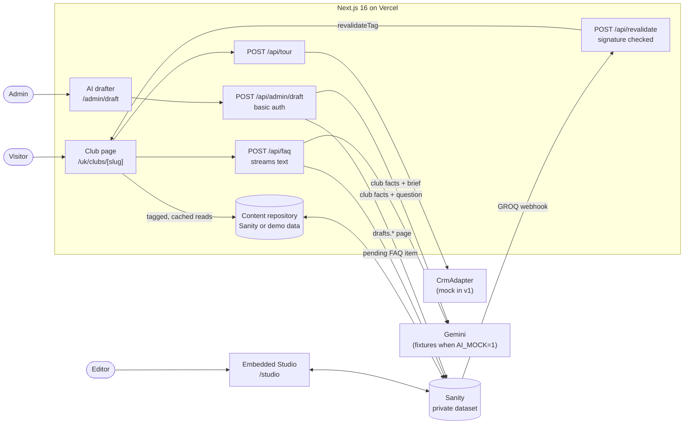

# Club Launch

A CMS-driven platform for launching social wellness club pages. Editors build each club's page from
pre-built, tested blocks. Two AI helpers draft pages and answer visitor questions, and an editor
always has the final say.

- **Live app:** _added after the first Vercel deploy_
- **Storybook:** _added after the Storybook deploy_
- **90-second walkthrough:** _video link added after recording_

Designed around a premium operator's rollout of social wellness clubs, where existing gyms are
relaunched one site at a time.

## The problem

Converting a gym into a social wellness club is a launch, not a CMS edit. Every site needs a
marketing page, tour bookings, and answers to the same member questions. When each launch is a
bespoke build, the pages drift apart, launches wait on engineers, and FAQs lag behind what people
actually ask.

## What it does

- **Club pages from blocks.** Hero, facilities, spa and recovery, rates, tour booking and FAQ. Each
  block is one Sanity type and one React component with its own Storybook stories and tests.
  Editors arrange blocks in the embedded Studio at `/studio` and publish; the live page updates
  through a signed webhook, without a redeploy.
- **Tour booking.** An accessible form that is validated on both client and server, with a
  honeypot, per-IP rate limiting, and a `CrmAdapter` interface that retries once. v1 ships a mock
  adapter that logs a redacted line.
- **Infinite FAQ.** Visitors ask "Anything else?". The answer streams in, grounded only on that
  club's facts and approved answers, and is saved as a **pending** item for an editor to approve.
  Repeat questions are answered from the saved item without calling the model.
- **AI page drafter.** At `/admin/draft` (basic auth), a brief becomes an **unpublished draft**
  page. Any price, date or number the model doesn't have becomes a `[[PLACEHOLDER]]`, and Studio
  won't publish the page until every placeholder is replaced.
- **SEO and performance.** Pages are statically rendered and revalidated by tag. Each page has
  `generateMetadata`, a canonical URL and `HealthClub` JSON-LD, and the site serves a sitemap and
  robots file. Images go through Sanity's CDN.

## Architecture



All Sanity reads happen on the server with a token, and the dataset is private. The content
repository has two implementations: Sanity, and an in-memory store built from the same demo data
that `pnpm seed` writes. CI, e2e and local development without credentials use the in-memory store
(`CONTENT_MOCK=1`).

## Key decisions and trade-offs

- **One block, one type, one component, one story.** Editors can't break the layout, and every
  block is tested in isolation, including its accessibility.
- **Static by default, revalidated on demand.** Published reads are cached by document type and
  club slug. The webhook expires tags immediately (`revalidateTag(tag, { expire: 0 })`). Tags are
  coarse, which is correct and cheap at this scale.
- **The drafter returns one strict object per block** rather than a free-form array. Gemini's
  structured output handles fixed shapes more reliably, and every page gets all six blocks.
- **Plain-text streaming for the FAQ, with status in headers.** The client needs to know whether
  an answer came from the cache, the model or the fallback before it reads the body.
- **In-memory rate limiting, per instance.** Free and simple. On serverless each warm instance
  keeps its own window, so the real limit is higher. A shared store is the next step (see below).
- **Free tiers only.** Gemini's free tier, Sanity's free plan, and Vercel Hobby. Images are served
  by Sanity's CDN, so Vercel's image quota is never used.

## How AI is kept safe

- **AI never publishes.** It creates Sanity drafts (`drafts.` ids) and pending FAQ items only.
  Only answers with `status == "approved"` render for visitors.
- **Grounded on one club.** The FAQ model sees only that club's document and its approved answers.
  The drafter sees only the club's facts: no contact details, and nothing about other clubs.
- **Placeholders block publishing.** A document-level validation rule fails while any `[[`
  remains, and a Studio banner lists what's left. After the model responds, any number that isn't
  in the club's facts is wrapped as `[[CHECK: n]]`.
- **Visitor text is data, not instructions.** It is fenced in tags, stripped of `<` and `>`, and
  the instructions say to treat it only as a question. Emails and phone numbers are redacted
  before the model or the CMS sees them. Form submissions never go to the model.
- **Everything is validated with zod**: every API input, the drafter's output (retried once, then
  a clear error), and the FAQ answer before it is saved.
- **Refusals and fallbacks.** Medical, personal-data and unlisted-price questions get a short,
  polite pointer to a tour. Quota and API errors return a friendly fallback, and nothing is
  saved.

## Testing

| Layer | What | Where |
|---|---|---|
| Unit (Vitest) | Schemas, normalisation, grounding context, prompt fencing, redaction, rate limiter, CRM retry, drafter retry, number guard, publish rule, JSON-LD, webhook signatures, API routes | `**/*.test.ts` |
| Component (Storybook + Vitest browser) | Every component in light, dark and mobile, with edge cases and interaction tests; any axe violation fails the build | `**/*.stories.tsx` |
| End to end (Playwright + axe) | Keyboard-only tour booking; FAQ streaming, session-only pending answers, cache hits, refusals and the quota fallback; the drafter; admin auth | `e2e/` |

All AI calls in CI and e2e use `AI_MOCK=1`: deterministic fixtures that still run through the real
AI SDK code (`MockLanguageModelV4`). Ask a question containing "quota" to trigger the quota
fixture.

## Run it locally

Requires Node 24 and pnpm 12.

```bash
pnpm install
cp .env.example .env.local   # works as-is with demo content; add Sanity and Gemini keys to go live
pnpm dev                     # http://localhost:3000
```

Without a Sanity project id, the site serves the bundled demo content, and `/studio` explains
what to configure. With Sanity configured:

```bash
pnpm seed           # market, a fully built Mayfair-style page, a Moorgate-style club with facts only
pnpm seed --reset   # also removes Moorgate drafts and AI FAQ items, to rehearse the demo
```

| Command | What it does |
|---|---|
| `pnpm lint` / `pnpm typecheck` / `pnpm test` | ESLint, TypeScript, Vitest unit tests |
| `pnpm storybook` / `pnpm test-storybook` / `pnpm build-storybook` | Storybook, its component and a11y tests, static build |
| `pnpm e2e` | Builds, starts with `AI_MOCK=1` and demo content, runs Playwright |
| `pnpm build` / `pnpm start` | Production build and server |

Environment variables are listed in [`.env.example`](.env.example).

## What I'd do next with real systems

- A real `CrmAdapter` (for example Salesforce or HubSpot) with idempotency keys and a dead-letter
  queue, so no tour request is lost.
- A shared rate limiter and FAQ cache (Redis or Vercel KV) so limits hold across instances.
- Grouping of similar questions, with embeddings, so editors approve one answer for many phrasings.
- Multiple markets and locales: the `market` document and URL segment already exist.
- An editor dashboard: questions asked most, refusal rate, and time to approval.
- Visual regression tests and Lighthouse budgets in CI.
