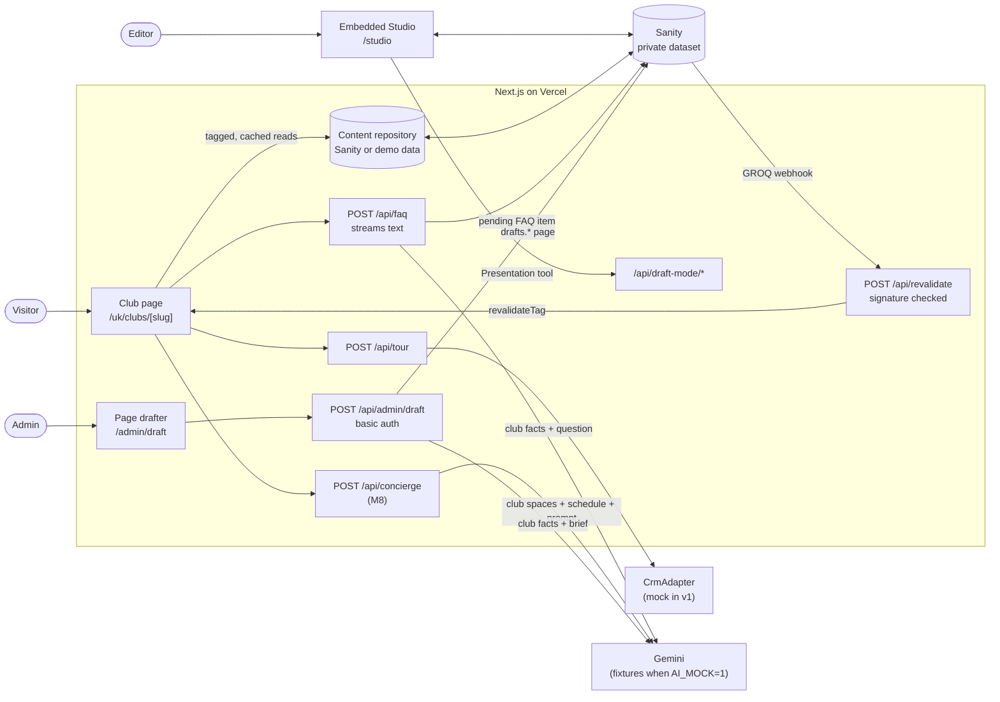
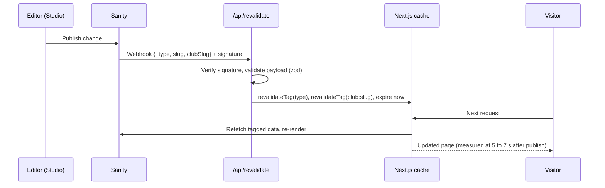
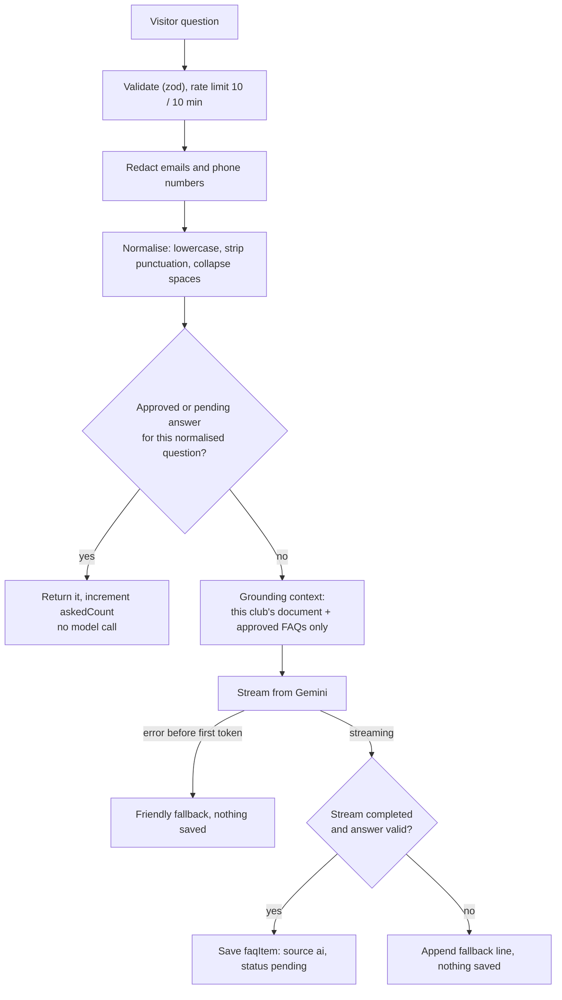

# Architecture

Club Launch is a single Next.js application on Vercel. It serves public club pages, hosts the
Sanity Studio that editors use to build those pages, runs an admin page drafter, and exposes a
small set of API routes. Content lives in a private Sanity dataset. Two AI features use Google's
Gemini through the Vercel AI SDK, and both are designed so that a person always approves what the
public sees.

## System overview

| Area | Where |
|---|---|
| Routes and API handlers | `app/` (`(site)` for public pages, `api/` for handlers, `studio/` for the Studio) |
| Page blocks and UI components | `components/blocks`, `components/ui`, `components/site` |
| Content access | `lib/content` (repository interface, Sanity and demo implementations, cache tags) |
| AI features | `lib/faq`, `lib/drafter`, `lib/ai` (model selection and mock fixtures) |
| Forms and integrations | `lib/tour`, `lib/crm`, `lib/rate-limit.ts` |
| Sanity schemas, Studio structure, publish rules | `sanity/` |
| Seed data and tooling | `scripts/` |

## Content model

| Document | Purpose | Key fields |
|---|---|---|
| `market` | A country or region | `code` (`uk`), `locale` (`en-GB`), `currency` (`GBP`) |
| `club` | The facts about one club, and the single source for everything that grounds the AI | name, slug, market, tier, status, address, geo, opening hours, phone, facilities, facts (label/value pairs such as the joining fee), SEO |
| `clubPage` | The page editors build for a club | club, title, ordered `blocks[]`, SEO override |
| `faqItem` | A question and answer for one club | question, answer, `source` (`editor`/`ai`), `status` (`approved`/`pending`/`rejected`), `askedCount`, `normalizedQuestion` |

A `clubPage` is an ordered list of six block types: `heroBlock`, `facilitiesBlock`,
`spaRecoveryBlock`, `ratesBlock`, `tourBookingBlock` and `faqBlock`. Each block type has exactly one
React component of the same name in `components/blocks`, with its own Storybook stories.
`BlockRenderer` maps `_type` to component. Editors can reorder and edit blocks but cannot produce a
layout that has not been built and tested.

Every Sanity result is parsed with zod into a view model before rendering. A malformed block is
dropped and logged, so one bad edit cannot take the page down.

The content repository has two implementations behind one interface: Sanity, and an in-memory
store built from the same demo data that `pnpm seed` writes. Demo mode (`CONTENT_MOCK=1`, or no
Sanity project configured) makes CI and end-to-end tests deterministic and lets the app run without
credentials.

## Request flows

### Page rendering and revalidation on publish

Club pages are statically rendered. Every published read is a `fetch` with `cache: 'force-cache'`
and tags for each document type it depends on, plus `club:<slug>`.

Tags are deliberately coarse, keyed by document type and club, which is always correct and cheap
at this scale. The route rejects unsigned requests (401) and fails closed if the secret is not set
(503).

### Draft mode preview

The Studio's Presentation tool opens a club page with draft mode enabled.
`/api/draft-mode/enable` uses `next-sanity`'s `defineEnableDraftMode`, which checks a preview
secret that the Studio issues. While draft mode is on, the page reads with the `drafts`
perspective and shows a banner with an "Exit preview" button. Exiting is a POST to
`/api/draft-mode/disable` because it changes state.

### Tour booking

The form is validated with the same zod schema on the client and the server. The route applies a
per-IP rate limit (5 per 10 minutes) and a honeypot field; a bot that fills the honeypot gets a
realistic success response and nothing is sent on. Valid leads go to a `CrmAdapter`, chosen by
the `CRM_ADAPTER` environment variable. If the adapter throws, the route retries once and then
returns a friendly error, and the form keeps what the visitor typed. v1 ships a mock adapter that
logs one redacted line (reference, club, date, slot), never a name, email or phone number.

### FAQ ("Anything else?")

The response is a plain-text stream. Headers carry the status (`X-Faq-Status`), where the answer
came from (`X-Faq-Source`: cache, model or fallback) and the item id, because the client needs
them before it reads the body. The new pending answer is kept in the asker's `sessionStorage` so
only they see it, labelled "New, awaiting review". An editor approves it in Studio; publishing
the change triggers revalidation, and it then appears for everyone.

### First-day concierge (ships in M8)

A visitor describes their week, optionally picking quick chips, and gets a timeline of 4 to 6
stops through a day at the club. The route validates the input, rate limits it (5 per 10
minutes), and builds a grounding context from that club's spaces, sample schedule, facilities,
opening hours and plans. The model returns a structured plan. A validator then checks every stop
against the club's data: each space must exist, each time must fall within opening hours, and
each class must be on the schedule at that time. If any check fails, the errors go back to the
model for one retry, and a second failure returns a friendly error. The stored plan holds only the structured
result under a random public id, never the visitor's text. "Book a tour for this day" attaches
the plan id to the tour lead, so contact details are collected after the model has run and never
reach it.

### Page drafter

`/admin/draft` and `/api/admin/draft` sit behind HTTP basic auth, enforced in `proxy.ts` and
checked again in the route. The route loads the chosen club's facts (no phone number or street
address) and asks the model for one strict object per block type. Output is validated with zod;
on failure the route tries once more, then returns a clear error. A number guard then wraps any
figure that does not appear in the club's facts as `[[CHECK: n]]`. The result is saved as a
Sanity draft (`drafts.` id) and the response lists the placeholders with a link to open the draft
in Studio. Nothing is published.

In Studio, a banner on the club page form lists the remaining placeholders, and a document-level
validation rule fails while any `[[` remains. Sanity does not allow publishing a document with
validation errors, so a draft cannot go live until every placeholder is replaced.

## AI safety design

| Risk | Control |
|---|---|
| AI content reaching the public unreviewed | AI writes only Sanity drafts and `pending` FAQ items. Only `approved` FAQs render. Placeholders block publishing. |
| Invented facts | Grounding on one club's data only. Unknown prices, dates and numbers become placeholders, and the number guard catches the rest. FAQ questions outside the context get a polite refusal. |
| Health questions | The FAQ politely declines and suggests a tour or contacting the club. The concierge may suggest facilities but adds a caveat recommending a qualified professional and never gives advice. |
| Prompt injection | Visitor text is fenced in tags with `<` and `>` stripped, and the instructions treat it strictly as a question. Output is structured and validated, so injected instructions cannot change what gets saved. |
| Personal data | Tour submissions never go to the model. Emails and phone numbers are redacted from questions before the model or CMS sees them. The concierge stores only the structured plan. |
| Malformed output | zod on every response, one retry, then a clear error. |
| Quota exhaustion and outages | The FAQ waits for the first token before committing to a stream, so failures become a clean fallback. SDK retries are off, since quota errors don't clear in seconds. |
| Cost | Free tiers only. Rate limits on every AI route; repeated questions are served from the CMS without a model call. |

## Testing and CI

| Layer | Tooling | Covers |
|---|---|---|
| Unit | Vitest | Schemas, normalisation, grounding, prompt fencing, redaction, rate limiting, CRM retry, drafter retry, number guard, publish rule, JSON-LD, webhook signatures, route handlers, GROQ queries run with `groq-js` over the seed documents |
| Component | Storybook with the Vitest addon, in a real browser | Every component in light, dark and mobile, edge cases and interaction tests. Any axe accessibility violation fails the build. |
| End to end | Playwright with `@axe-core/playwright` against a production build | Keyboard-only tour booking, FAQ streaming and caching, refusals and fallback, the drafter, admin auth, WCAG 2.2 AA scans |

With `AI_MOCK=1`, the model is replaced by deterministic fixtures that still run through the real
AI SDK code paths (`MockLanguageModelV4`), so tests exercise the same streaming and
structured-output handling as production. CI runs three jobs on every push and pull request (lint,
typecheck, unit tests and build; Storybook tests and build; end-to-end), all with `AI_MOCK=1` and
demo content, so CI needs no secrets.

## Key decisions and trade-offs

- **One block, one schema type, one component, one story.** This limits what editors can do,
  deliberately: every layout they can produce has been tested, including for accessibility.
- **Static rendering with on-demand revalidation.** Pages are fast and cheap to serve, and
  published edits appear in seconds without a redeploy. The cost is webhook plumbing and a
  signature check.
- **A content repository interface.** It adds a layer, but lets the whole app, CI and the e2e
  suite run against demo data with no credentials.
- **Plain-text streaming with metadata in headers** for the FAQ, instead of a chat protocol,
  because the client needs to know the answer's status before reading it.
- **One strict object per block for the drafter**, rather than a free-form array of a union type.
  Gemini's structured output is much more reliable with fixed shapes, and every draft gets all six
  blocks.
- **In-memory, per-instance rate limiting.** Free and simple, but on serverless each warm instance
  keeps its own window, so the effective limit is higher. A shared store (Redis or Vercel KV) is
  the upgrade path.
- **Images served by Sanity's CDN** through a custom `next/image` loader, so Vercel's image
  optimisation quota is never used.
- **Free tiers only**: Gemini's free tier, Sanity's free plan and Vercel Hobby. New FAQ answers
  take 5 to 9 seconds to start on the free tier; repeats are served from the CMS in about 2.
