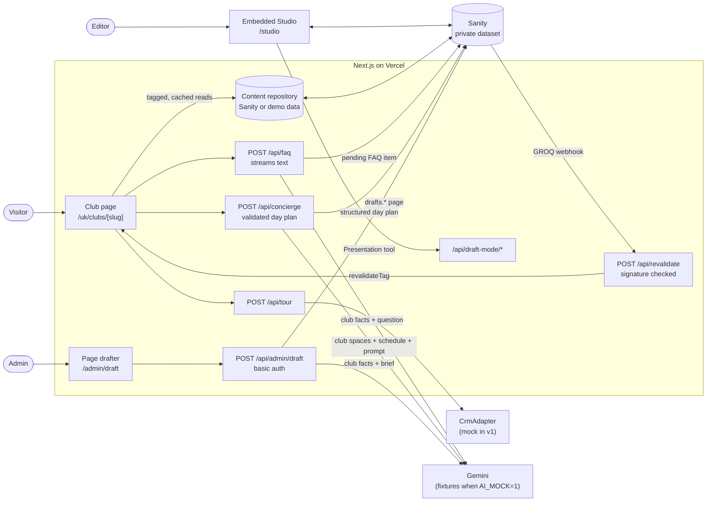
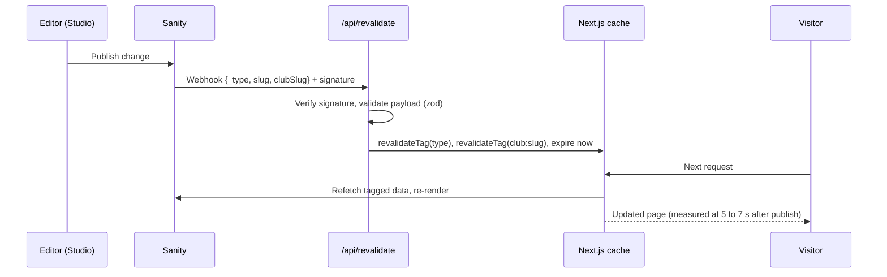
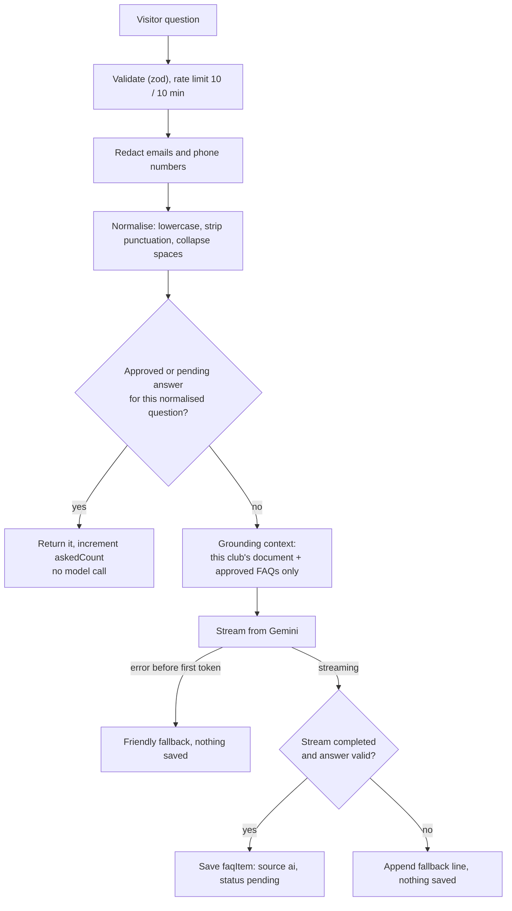
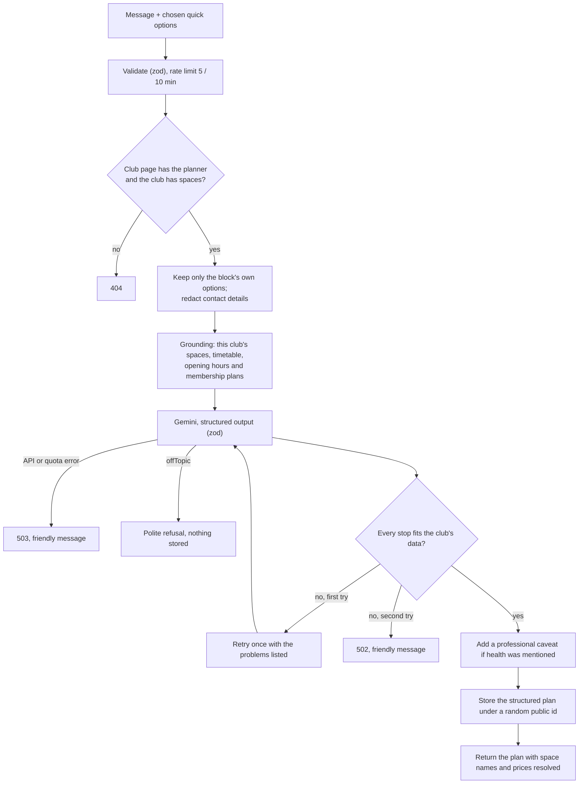

# Architecture

Club Launch is a single Next.js application on Vercel. It serves public club pages, hosts the
Sanity Studio that editors use to build those pages, runs an admin page drafter, and exposes a
small set of API routes. Content lives in a private Sanity dataset. Two AI features use Google's
Gemini through the Vercel AI SDK, and both are designed so that a person always approves what the
public sees.

## System overview

| Area | Where |
|---|---|
| Routes and API handlers | `app/` (`(site)` for public pages, `api/` for handlers, `studio/` for the Studio) |
| Page blocks and UI components | `components/blocks`, `components/ui`, `components/site` |
| Content access | `lib/content` (repository interface, Sanity and demo implementations, cache tags) |
| AI features | `lib/faq`, `lib/concierge`, `lib/drafter`, `lib/ai` (model selection and mock fixtures) |
| Forms and integrations | `lib/tour`, `lib/crm`, `lib/rate-limit.ts` |
| Sanity schemas, Studio structure, publish rules | `sanity/` |
| Seed data and tooling | `scripts/` |

## Content model

| Document | Purpose | Key fields |
|---|---|---|
| `market` | A country or region | `code` (`uk`), `locale` (`en-GB`), `currency` (`GBP`), typical local prices for the cost calculator's comparison (use, label, unit price, unit) |
| `club` | The facts about one club, and the single source for everything that grounds the AI | name, slug, market, tier, status, address, geo, time zone, opening hours, phone, spaces (the one facilities list: id, name, category, description, typical uses, optional own hours), sample timetable (day, time, class, space, duration, intensity), an illustrative floor plan (floors of zones tied to spaces, plus decorative areas), facts (label/value pairs such as the joining fee), SEO |
| `clubPage` | The page editors build for a club | club, title, ordered `blocks[]`, SEO override |
| `faqItem` | A question and answer for one club | question, answer, `source` (`editor`/`ai`), `status` (`approved`/`pending`/`rejected`), `askedCount`, `normalizedQuestion` |
| `dayPlan` | A visitor's planned first day, written by the concierge and read-only in Studio | public id, club (weak reference), day, summary, stops (time, space id, class, activity, reason), suggested membership, caveats, quick options chosen. Never the visitor's message. |

A `clubPage` is an ordered list of blocks: `heroBlock`, `facilitiesBlock`, `clubMapBlock`, `conciergeBlock`
(the first-day planner), `spaRecoveryBlock`, `ratesBlock`, `calculatorBlock` (the cost
calculator), `tourBookingBlock` and `faqBlock`. Each block type has exactly one
React component of the same name in `components/blocks`, with its own Storybook stories.
`BlockRenderer` maps `_type` to component. Editors can reorder and edit blocks but cannot produce a
layout that has not been built and tested.

Every Sanity result is parsed with zod into a view model before rendering. A malformed block is
dropped and logged, so one bad edit cannot take the page down.

The content repository has two implementations behind one interface: Sanity, and an in-memory
store built from the same demo data that `pnpm seed` writes. Demo mode (`CONTENT_MOCK=1`, or no
Sanity project configured) makes CI and end-to-end tests deterministic and lets the app run without
credentials.

## Request flows

### Page rendering and revalidation on publish

Club pages are statically rendered. Every published read is a `fetch` with `cache: 'force-cache'`
and tags for each document type it depends on, plus `club:<slug>`.

Tags are deliberately coarse, keyed by document type and club, which is always correct and cheap
at this scale. Club pages also regenerate at most every 15 minutes (`revalidate = 900`) so the
time-of-day hero follows the club's clock; the cached data they read stays cached until a
webhook expires it. The route rejects unsigned requests (401) and fails closed if the secret is not set
(503).

### Draft mode preview

The Studio's Presentation tool opens a club page with draft mode enabled.
`/api/draft-mode/enable` uses `next-sanity`'s `defineEnableDraftMode`, which checks a preview
secret that the Studio issues. While draft mode is on, the page reads with the `drafts`
perspective and shows a banner with an "Exit preview" button. Exiting is a POST to
`/api/draft-mode/disable` because it changes state.

### Tour booking

The form is validated with the same zod schema on the client and the server. The route applies a
per-IP rate limit (5 per 10 minutes) and a honeypot field; a bot that fills the honeypot gets a
realistic success response and nothing is sent on. Valid leads go to a `CrmAdapter`, chosen by
the `CRM_ADAPTER` environment variable. If the adapter throws, the route retries once and then
returns a friendly error, and the form keeps what the visitor typed. v1 ships a mock adapter that
logs one redacted line (reference, club, date, slot), never a name, email or phone number.

### FAQ ("Anything else?")

The response is a plain-text stream. Headers carry the status (`X-Faq-Status`), where the answer
came from (`X-Faq-Source`: cache, model or fallback) and the item id, because the client needs
them before it reads the body. The new pending answer is kept in the asker's `sessionStorage` so
only they see it, labelled "New, awaiting review". An editor approves it in Studio; publishing
the change triggers revalidation, and it then appears for everyone.

### First-day concierge

The model returns a fixed-shape object: the day, 4 to 6 stops (time, space id, class name or
empty, activity, reason), a suggested membership and any caveats. zod checks the shape; a
separate validator (`lib/concierge/validate.ts`) checks meaning. Each space must exist. Each time
must fall within the club's hours that day, or the space's own hours where it has them. Each
named class must be on the timetable that day, at that time, in that space. Stops must be in
order, and the membership must be a real plan. Problems are written so they can be fed back to
the model verbatim for its one retry.

The visitor's message is redacted, fenced and never stored. The stored `dayPlan` holds only the
structured plan and which of the block's quick options were chosen; options the block doesn't
offer are dropped before the model or the store sees them. If the visitor mentions an injury or
a health condition, the server makes sure the plan carries a caveat recommending a GP or
physiotherapist, even if the model forgot.

"Book a tour for this day" keeps the plan's public id in `sessionStorage` and moves focus to the
tour form, which shows that the plan is attached and lets the visitor remove it. The tour route
loads the plan by id, checks it belongs to the same club, and passes `{ lead, dayPlan }` to the
CRM adapter. The model runs before any contact details exist, so it never sees them.

### Time-of-day atmosphere

`lib/atmosphere/period.ts` maps the club's local hour (from its IANA time zone) to morning
06–11, midday 11–16, evening 16–22 or night. The club page works out the period on the server
and passes it down, so the right wording is in the HTML and nothing changes after hydration.
The hero uses the editor's wording for that period where set (falling back to the default),
a gradient from a period tint token into the page colour, and a link to the section suited to
that time: the map in the morning, the first-day planner at midday and at night, spa and
recovery in the evening. The link only appears if the page has that section. Every text colour
was checked for AA against each tint at full strength, in light and dark.

The trade-off: the period can lag by up to the 15-minute regeneration window. A client-side
script could switch it exactly, but at the cost of a flash or hydration workarounds.

### Busyness forecast

Busyness is simulated, and labelled as illustrative wherever it appears.
`lib/busyness/generator.ts` builds a typical level (0–100, in steps of 5) for each space, hour
and weekday from a curve per kind of space (morning and after-work peaks in the gym, a quiet
mid-afternoon, the spa busiest in the evening and at weekends) plus a little noise from a seeded
random number generator. The seed is the club, space and day, so the numbers are the same on
the server and in the browser, and in every test run. Hours when the space is closed are empty.

The same figures feed three places: the busyness block (small column charts per space, the
quietest hour highlighted, a summary line and a hidden table), the map's details panel ("usually
quiet at this time"), and the planner's grounding context, which lists each space's quietest
hours so the model can avoid crowds when asked. Replacing the generator with real gate-entry
data would change one module.

### Shared day plans

"Share my day" uses the device's share sheet (`navigator.share`) or copies the link to
`/[market]/clubs/[slug]/day/[dayPlanId]`. That page is rendered on request: the loader rejects a
malformed id before any lookup, loads the plan and the club page, and returns 404 if the plan
belongs to a different club than the URL names. It shows the structured plan only (the visitor's
message was never stored) and is marked `noindex, nofollow`.

Its Open Graph image is an `opengraph-image.tsx` route drawn with `next/og` in the site's own
typefaces and colours: the day, the club, the first four stops and the platform name. `next/og`
can't read the WOFF2 files that `next/font` serves, so TrueType copies of the two open-licence
fonts live in `assets/fonts`.

### Club map

The floor plan is data on the club document: a `viewBox`, floors, and zones that are either
rectangles or polygons, each tied to a space by id, plus decorative areas such as a garden.
`lib/map/geometry.ts` parses shapes (malformed ones are dropped), places labels and orders
zones top to bottom and left to right for the arrow keys.

The map is an SVG `radiogroup`: each zone is a `radio` with an accessible name, one Tab stop
(roving tabindex), and arrow keys that move and select, like any radio group. Floors are a tab
list. Selecting a zone fills a details region whose space is reserved, so nothing on the page
moves. A "View as list" toggle shows the same content as headed lists, and a polite status line
announces the selection. Zones lift on hover and focus only when reduced motion isn't
requested.

"What's on now" (`lib/map/whats-on.ts`) is pure: given an instant and the club's IANA time zone
it works out the local weekday and time with `Intl.DateTimeFormat`, whether the space is open
(its own hours or the club's), the class running now, and the next one up to a week ahead. The
page is static, so the component reads the clock only after hydration and refreshes it every
minute; the server never renders a time-dependent value, which avoids hydration mismatches.

"Add to my day" passes the space to the first-day planner through a small in-page channel
(`lib/concierge/prefill.ts`), which adds it to the planner's message and focuses the box.

### Cost calculator

The calculator is a client component over a pure module, `lib/calculator/calculate.ts`, so every
figure on screen comes from unit-tested arithmetic: visits a month (visits a week × 52 / 12),
cost per visit, the joining fee spread over 12 months, and the cost of paying separately (each
chosen use counted once per visit at the market's typical price). Zero visits shows no cost per
visit rather than dividing by zero, and visits are clamped to 0–7.

Plan prices come from the page's rates block; comparison prices come from the club's `market`
document. Both are part of the tagged club-page read, and the webhook already covers `clubPage`
and `market`, so a price edited in Studio is live in seconds without a redeploy. The comparison
prices sit on the market rather than in a document type of their own for that reason: a new type
would need adding to the webhook's filter.

The chart is two horizontal bars in plain HTML (membership in the brand colour, paying
separately in a recessive grey), with values at the bar tips in text colours and a visually
hidden table holding the full breakdown. HTML bars keep their labels at a readable size on a
phone, where SVG text would scale down with the drawing.

### One source per fact

Each fact has one home. The club document holds opening hours, address, phone, map position,
time zone, spaces (which are also the facilities list, via `facilitiesOf`), the sample
timetable and the other facts. Membership prices live in the page's rates block and a founding
price in its founding block: the drafter only writes page drafts, and prices are exactly what it
must leave as placeholders. Everything else reads from those homes: the facilities block, the
map and busyness, JSON-LD and the tour details from the club; the calculator, the planner and
the FAQ grounding take prices from the page (`offersOf`).

`lib/facts/audit.ts` enforces it, and CI runs it over the seed content (`pnpm check:facts`).
It fails when a block stores a club field; when block copy repeats the club's phone number,
address or one of its opening times; when a price appears anywhere but the offer blocks' price
fields; when spa copy repeats a space's description word for word; or when a club fact restates
a price the page offers. The one-off migration that moved production to this shape is
`scripts/migrations/single-source.ts` (in two stages, with a dry run).

### Founding member pre-sale

A `foundingBlock` (offer, price, joining fee, total places) only accepts signups for clubs whose
status is "coming soon". The count of places taken is a `foundingPlaces` document per club,
written only by the site. `lib/founding/places.ts` claims a place optimistically: read the count
and its revision, then write the count plus one only if the revision hasn't changed (Sanity's
`ifRevisionId`; the very first write uses `create`, which fails if another request created the
document first), and on a clash read again and retry. If the count has reached the total, the
signup is refused as sold out. A unit test runs 40 parallel claims against 10 places and checks
exactly 10 succeed; another runs through the API route with the last five places.

`POST /api/founding` validates with the tour form's shared contact fields, rate limits, honours
the honeypot (a fake success, no place taken), claims a place, then sends the signup to the CRM
adapter (`submitFoundingMember`, retried once). If the CRM fails, the place is released. The
page is static, so the count it renders can be up to 15 minutes old; the block fetches the live
count from `GET /api/founding` once it has loaded.

### Launch readiness

`lib/readiness/checks.ts` holds seven rules that run on raw Sanity documents: no placeholders,
alt text on every uploaded image, an SEO title of 10–60 characters and a description of
50–160 (the page's own, or the club's), valid opening hours (real days, 24-hour times, opening
before closing, no repeats), a numeric joining fee on every plan with a price, a tour booking
block, and at least five approved FAQs for the club. Each failure says what to do ("Add the
joining fee to "Founding member"").

The Studio uses the same rules in three places: a document validation rule on club pages
(an error, which blocks publishing, fetching the club and its approved FAQ count through the
validation context's client), a badge ("Ready 71%") with what's missing as its tooltip, and a
checklist on the form, plus a "Launch readiness" tool that lists every club page, drafts first,
with its score and checklist. Placeholders are reported by the existing placeholder rule, so the
readiness rule skips them to avoid saying it twice.

### Question insights

`/admin/insights` sits behind the same basic auth as the drafter and is rendered fresh on each
request. The repository lists every FAQ item for the club (all statuses, with when it was first
asked) and its recent day plans; `lib/insights/insights.ts` shapes them, and the page only
renders.

Near-duplicate questions are grouped by word overlap (`lib/insights/group.ts`): questions are
normalised, filler words dropped and plurals and "-ing" endings trimmed, and two questions
match when at least 60% of the shorter one's words appear in the other. Questions are taken
most-asked first, so each group is titled by its most common wording. Answers the assistant
gave when it couldn't help are recognised by their shape ("can't answer", "don't have that
information"), since the model words them freely. Planner themes count only the quick options
people tapped and the kinds of caveat added: the visitor's own words are never stored.

### Page drafter

`/admin/draft` and `/api/admin/draft` sit behind HTTP basic auth, enforced in `proxy.ts` and
checked again in the route. The route loads the chosen club's facts (no phone number or street
address) and asks the model for one strict object per block type. Output is validated with zod;
on failure the route tries once more, then returns a clear error. A number guard then wraps any
figure that does not appear in the club's facts as `[[CHECK: n]]`. The result is saved as a
Sanity draft (`drafts.` id) and the response lists the placeholders with a link to open the draft
in Studio. Nothing is published.

In Studio, a banner on the club page form lists the remaining placeholders, and a document-level
validation rule fails while any `[[` remains. Sanity does not allow publishing a document with
validation errors, so a draft cannot go live until every placeholder is replaced.

## AI safety design

| Risk | Control |
|---|---|
| AI content reaching the public unreviewed | AI writes only Sanity drafts and `pending` FAQ items. Only `approved` FAQs render. Placeholders block publishing. |
| Invented facts | Grounding on one club's data only. Unknown prices, dates and numbers become placeholders, and the number guard catches the rest. FAQ questions outside the context get a polite refusal. |
| Health questions | The FAQ politely declines and suggests a tour or contacting the club. The concierge may suggest gentle classes and recovery, never diagnoses or promises results, and the server guarantees a caveat recommending a GP or physiotherapist. Plans never repeat the health detail itself. |
| Prompt injection | Visitor text is fenced in tags with `<` and `>` stripped, and the instructions treat it strictly as a question. Output is structured and validated, so injected instructions cannot change what gets saved. |
| Personal data | Tour submissions never go to the model. Emails and phone numbers are redacted from questions before the model or CMS sees them. The concierge stores only the structured plan. |
| Malformed output | zod on every response, one retry, then a clear error. Day plans are also checked against the club's real spaces, hours and timetable, with the problems fed back for the retry. |
| Quota exhaustion and outages | The FAQ waits for the first token before committing to a stream, so failures become a clean fallback. SDK retries are off, since quota errors don't clear in seconds. The concierge retries once after 1.5 s when the provider reports a temporary overload (5xx), but never on quota errors. The drafter retries an overload with backoff (up to 2 extra tries), and reports a still-overloaded or rate-limited provider as a distinct, clear error from a model answer that failed validation. |
| Cost | Free tiers only. Rate limits on every AI route; repeated questions are served from the CMS without a model call. |

## Testing and CI

| Layer | Tooling | Covers |
|---|---|---|
| Unit | Vitest | Schemas, normalisation, grounding, prompt fencing, redaction, rate limiting, CRM retry, drafter retry, number guard, publish rule, day-plan validator, retry and health caveats, the model request payload (no personal data), JSON-LD, webhook signatures, route handlers, GROQ queries run with `groq-js` over the seed documents |
| Component | Storybook with the Vitest addon, in a real browser | Every component in light, dark and mobile, edge cases and interaction tests. Any axe accessibility violation fails the build. |
| End to end | Playwright with `@axe-core/playwright` against a production build | Keyboard-only tour booking, keyboard-only day planning and booking a tour for that day, FAQ streaming and caching, refusals and fallback, the drafter, admin auth, WCAG 2.2 AA scans |

With `AI_MOCK=1`, the model is replaced by deterministic fixtures that still run through the real
AI SDK code paths (`MockLanguageModelV4`), so tests exercise the same streaming and
structured-output handling as production. CI runs three jobs on every push and pull request (lint,
typecheck, unit tests and build; Storybook tests and build; end-to-end), all with `AI_MOCK=1` and
demo content, so CI needs no secrets.

## Demo recording

`scripts/demo/` records the two-minute product walkthrough with Playwright against a real
deployment: `pnpm demo:login` saves a Studio session once, `pnpm demo:record` drives the club
page, the drafter, the Studio and the FAQ with a visible cursor and on-screen captions, and
`pnpm demo:build` makes the MP4. Every document a take creates (day plan, pending FAQ answer,
drafted page) carries a hidden `demo: true` marker and is listed in `.demo/created.json`, so
`pnpm demo:reset` removes exactly those and leaves the drafted club without a page again. It runs
against the real model, not `AI_MOCK`, because the video has to show genuine output. See
[scripts/demo/README.md](../scripts/demo/README.md).

## Key decisions and trade-offs

- **One block, one schema type, one component, one story.** This limits what editors can do,
  deliberately: every layout they can produce has been tested, including for accessibility.
- **Static rendering with on-demand revalidation.** Pages are fast and cheap to serve, and
  published edits appear in seconds without a redeploy. The cost is webhook plumbing and a
  signature check.
- **A content repository interface.** It adds a layer, but lets the whole app, CI and the e2e
  suite run against demo data with no credentials.
- **Plain-text streaming with metadata in headers** for the FAQ, instead of a chat protocol,
  because the client needs to know the answer's status before reading it.
- **An invented floor plan, stored as shapes.** Real plans aren't public and could be a
  security or copyright risk; an illustrative plan in the same zone format shows the idea and is
  editable in Studio. It is labelled illustrative on the page.
- **Cost comparisons are shown, not claimed.** The typical prices are editable per market,
  labelled on the page as illustrative, and every assumption (each use counted once per visit,
  the joining fee spread over a year) is written out under the chart.
- **Prices on the page, everything else on the club.** Moving prices onto the club would
  have meant the drafter editing club records or losing its price placeholders; one home per
  fact matters more than every fact sharing a document.
- **Optimistic concurrency for founding places**, not a lock: the content store already offers
  revision checks, contention is low, and a clash costs one retry. A shared lock service would
  be a new paid dependency.
- **Grouping without embeddings.** Word overlap with light stemming is explainable to a club
  manager, free, and good enough for a few hundred questions; embeddings are the next step if
  paraphrases with no shared words become common.
- **Two layers of validation for day plans.** A schema can only say a time looks like `07:15`;
  it can't say the reformer class is on at 07:15 on Tuesdays. The domain validator is what makes
  a generated timetable trustworthy, and feeding its messages back gives the retry a real chance.
- **Spaces are the facilities list.** Spaces carry the ids, hours and typical uses the planner
  and map need; the facilities list shown on the page is derived from them, so there is one list.
- **One strict object per block for the drafter**, rather than a free-form array of a union type.
  Gemini's structured output is much more reliable with fixed shapes, and every draft gets all six
  blocks.
- **In-memory, per-instance rate limiting.** Free and simple, but on serverless each warm instance
  keeps its own window, so the effective limit is higher. A shared store (Redis or Vercel KV) is
  the upgrade path.
- **Images served by Sanity's CDN** through a custom `next/image` loader, so Vercel's image
  optimisation quota is never used.
- **Free tiers only**: Gemini's free tier, Sanity's free plan and Vercel Hobby. New FAQ answers
  take 5 to 9 seconds to start on the free tier; repeats are served from the CMS in about 2.
